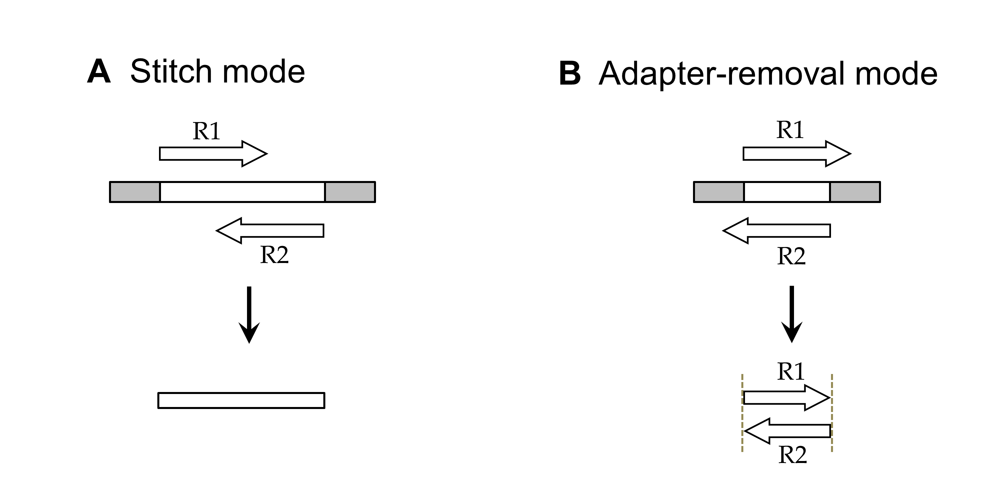
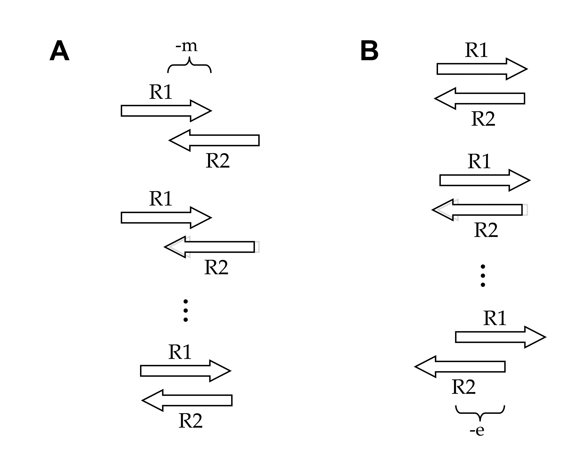

# NGmerge: merging paired-end reads and removing sequencing adapters

Gaspar JM. BMC Bioinformatics. 2018 Dec 20;19(1):536. [[PubMed](https://www.ncbi.nlm.nih.gov/pubmed/30572828)] [[BMC](https://bmcbioinformatics.biomedcentral.com/articles/10.1186/s12859-018-2579-2)] [[PDF](https://rdcu.be/bd2AW)]

## Table of Contents
* [Introduction](#intro)
  * [Quick start](#quick)
  * [Software compilation](#compile)
  * [Usage message](#usage)
* [Alignment method](#align)
* [Stitch mode](#stitch)
  * [I/O files and options](#stitch-io)
  * [Alignment parameters](#stitch-aln)
  * [Quality score profile options](#stitch-qual)
* [Adapter-removal mode](#adapter)
  * [I/O files and options](#adapter-io)
  * [Alignment parameters](#adapter-aln)
* [Miscellaneous](#misc)
* [Contact](#contact)
<br><br>

## Introduction <a name="intro"></a>

NGmerge operates on paired-end high-throughput sequence reads in two distinct modes (Fig. 1).

In the default [stitch mode](#stitch), NGmerge combines paired-end reads that overlap into a single read that spans the full length of the original DNA fragment (Fig. 1A).  The ends of the merged read are defined by the 5' ends of the original reads.  Reads that fail the stitching process (due to a lack of sufficient overlap, or excessive sequencing errors) are placed into secondary output files, if the user requires them.

The alternative [adapter-removal mode](#adapter) returns the original reads as pairs, removing the 3' overhangs of those reads whose valid stitched alignment has this characteristic (Fig. 1B).  Reads whose alignments do not have such overhangs (or do not align at all) will also be printed to the output files, unmodified.

<figure>
  
  <figcaption><strong>Figure 1.  Analysis modes of NGmerge.</strong>  The diagrams show the paired-end reads (R1, R2) derived from sequencing DNA fragments (white boxes) with sequencing adapters (gray boxes) on either end.</figcaption>
</figure>
<br><br>

### Quick start <a name="quick"></a>

Given:
* `sample_R1.fastq.gz`, `sample_R2.fastq.gz` (paired-end sequence files for a sample)
* `NGmerge` (downloaded and compiled as described [below](#compile))
<br><br>

To produce stitched reads (Fig. 1A): `sample_merged.fastq.gz`
```
$ ./NGmerge  -1 sample_R1.fastq.gz  -2 sample_R2.fastq.gz  -o sample_merged.fastq.gz
```
<br>

To produce reads with adapters removed (Fig. 1B): `sample_noadapters_1.fastq.gz` and `sample_noadapters_2.fastq.gz`
```
$ ./NGmerge  -a  -1 sample_R1.fastq.gz  -2 sample_R2.fastq.gz  -o sample_noadapters
```
<br>


### Software compilation <a name="compile"></a>

The software can be downloaded from [GitHub](https://github.com/harvardinformatics/NGmerge). (and you're already here! congratulations!)

A Makefile is provided for compilation with [GCC](https://gcc.gnu.org/releases.html), and both [zlib](http://zlib.net) and [OpenMP](https://www.openmp.org/) are also required.  The program has been tested after compilation with GCC 6.3.0, zlib 1.2.8, and OpenMP 4.0.

To compile, run `make` in the folder in which the software was downloaded.  The executable `NGmerge` should be produced.
<br><br>


### Usage message <a name="usage"></a>

```
Usage: ./NGmerge {-1 <file> -2 <file> -o <file>}  [optional arguments]
Required arguments:
  -1  <file>       Input FASTQ file with reads from forward direction
  -2  <file>       Input FASTQ file with reads from reverse direction
  -o  <file>       Output FASTQ file(s):
                   - in 'stitch' mode (def.), the file of merged reads
                   - in 'adapter-removal' mode (-a), the output files
                     will be <file>_1.fastq and <file>_2.fastq
Alignment parameters:
  -m  <int>        Minimum overlap of the paired-end reads (def. 20)
  -p  <float>      Mismatches to allow in the overlapped region
                     (a fraction of the overlap length; def. 0.10)
  -a               Use 'adapter-removal' mode (also sets -d option)
  -d               Option to check for dovetailing (with 3' overhangs)
  -e  <int>        Minimum overlap of dovetailed alignments (def. 50)
  -s               Option to produce shortest stitched read
I/O options:
  -l  <file>       Log file for stitching results of each read pair
  -f  <file>       FASTQ files for reads that failed stitching
                     (output as <file>_1.fastq and <file>_2.fastq)
  -c  <file>       Log file for dovetailed reads (adapter sequences)
  -j  <file>       Log file for formatted alignments of merged reads
  -z/-y            Option to gzip (-z) or not (-y) FASTQ output(s)
  -i               Option to produce interleaved FASTQ output(s)
  -w  <file>       Use given error profile for merged qual scores
  -g               Use 'fastq-join' method for merged qual scores
  -q  <int>        FASTQ quality offset (def. 33)
  -u  <int>        Maximum input quality score (0-based; def. 40)
  -n  <int>        Number of threads to use (def. 1)
  -v               Option to print status updates/counts to stderr
```
<br>

## Alignment method <a name="align"></a>

In either analysis mode (Fig. 1), NGmerge evaluates all possible gapless alignments of a pair of reads in attempting to find an optimal one.  The determinations of which alignments are considered, and then which alignment (if any) is both valid and optimal, are made according to several parameters: `-m`, `-p`, `-d`, `-e`, and `-s`.

NGmerge begins by aligning a pair of reads (R1, R2) such that the minimum overlap parameter (`-m`, default 20bp) is met.  It then checks each possible alignment of the reads until they overlap with no 3' overhangs (Fig. 2A).  If the `-d` option is selected (or in adapter-removal mode [`-a`, which automatically sets `-d`]), NGmerge additionally evaluates dovetailed alignments (with 3' overhangs), down to the minimum length set by the `-e` parameter (Fig. 2B).

<figure>
  
  <figcaption><strong>Figure 2.  Alignments considered by NGmerge.  A:</strong> Default alignments range from those with the minimal overlap length (set by <code>-m</code>), to complete overlaps with no overhangs.  <strong>B:</strong> When the <code>-d</code> option is selected, NGmerge also evaluates dovetailed alignments.</figcaption>
</figure>
<br><br>

For each alignment, NGmerge computes the fraction mismatch (the number of mismatches between the R1 and R2 reads, divided by the overlap length).  Alignments with calculated values no more than the threshold set by the `-p` parameter (default 0.10) are considered valid.  If multiple valid alignments are found, the one with the lowest fraction mismatch is selected as the optimal alignment.  In rare cases where multiple alignments have identical fraction mismatches, the longest is preferred by default (unless `-s` is set).  In all of these calculations, ambiguous bases (Ns) are considered neither matches nor mismatches.

Further descriptions of these parameters are provided [below](#stitch-aln).
<br><br>

## Stitch mode <a name="stitch"></a>

### I/O files and options <a name="stitch-io"></a>

#### Input files <a name="stitch-input"></a>

```
  -1  <file>       Input FASTQ file with reads from forward direction
  -2  <file>       Input FASTQ file with reads from reverse direction
```

NGmerge analyzes unaligned paired-end reads in [FASTQ format](https://en.wikipedia.org/wiki/FASTQ_format).  The input files can be gzip-compressed.  Multiple sets of input files can be specified, comma-separated (or space-separated, in quotes).

The input files must list the reads in the same order.  The program requires that the paired reads' headers match, at least up to the first space character.

An input file of interleaved reads can be analyzed by not specifying a `-2` file.  Also, it is possible to read from `stdin` using `-`, e.g. `-1 -`.

Since the merged reads are defined by the 5' ends of the paired reads' alignments (Fig. 1A), one should be wary of quality trimming the reads at those ends.  For example, when using a program such as [qualTrim](https://github.com/jsh58/AmpliconTools), one should specify `-3` to ensure that quality trimming occurs only at the 3' ends, prior to using NGmerge.
<br><br>

#### Output files and options <a name="stitch-output"></a>

```
  -o  <file>       Output FASTQ file:
                   - in 'stitch' mode (def.), the file of merged reads
```
The primary output file in stitch mode is the file of merged reads, in FASTQ format.  It is possible to write to `stdout` with `-o -` (see also `-y`, below).
<br><br>

```
  -f  <file>       FASTQ files for reads that failed stitching
                     (output as <file>_1.fastq and <file>_2.fastq)
```
When specified, all the reads that failed the merging procedure will be written to the output files, as they appeared in the original inputs.
<br><br>

```
  -z/-y            Option to gzip (-z) or not (-y) FASTQ output(s)
```
By default, all FASTQ output files will be gzip-compressed if and only if the input files are (with multiple sets of input files, the outputs will be compressed if either of the first set of inputs is).  Specifying `-z` will guarantee that the outputs are gzip-compressed, whereas `-y` will guarantee that they are not, regardless of the inputs' formats.  Note that all gzip-compressed outputs will automatically have '.gz' appended to their filenames, if necessary.
<br><br>

```
  -i               Option to produce interleaved FASTQ output(s)
```
In stitch mode, this applies only to the optional output from `-f` (above).  Instead of two outputs, a single interleaved output will be produced (and no '.fastq' suffix will be appended to the filename).
<br><br>

```
  -l  <file>       Log file for stitching results of each read pair
```
This log file lists the following for each read pair in the input file(s):
<table>
  <tr>
    <td align="center">Read</td>
    <td>read header, not including <code>@</code></td>
  </tr>
  <tr>
    <td align="center">OverlapLen</td>
    <td>total length of the read overlap, including Ns; <code>NA</code> if reads were not merged (and remaining columns are left blank)</td>
  </tr>
  <tr>
    <td align="center">StitchedLen</td>
    <td>total length of the merged read</td>
  </tr>
  <tr>
    <td align="center">Mismatch</td>
    <td>fraction of mismatched bases (count of mismatches divided by overlap length [not including Ns]); must be less than or equal to <code>-p</code> value (see below)</td>
  </tr>
</table>
<br>

```
  -c  <file>       Log file for dovetailed reads (adapter sequences)
```
This log file lists the following for each read pair whose optimal valid alignment has 3' overhangs:
<table>
  <tr>
    <td align="center">Read</td>
    <td>read header, not including <code>@</code></td>
  </tr>
  <tr>
    <td align="center">Adapter_R1</td>
    <td>3' overhang of R1 read; <code>-</code> if no overhang</td>
  </tr>
  <tr>
    <td align="center">Adapter_R2</td>
    <td>3' overhang of R2 read; <code>-</code> if no overhang</td>
  </tr>
</table>

The columns are labeled 'Adapter' because, if the reads were not trimmed on their 5' ends, these extra sequences should be adapters.  If the sequences that appear in the 'Adapter' columns are not consistent, they may be false positives, and one should consider decreasing `-p` or increasing `-e`.
<br><br>

```
  -j  <file>       Log file for formatted alignments of merged reads
```
For each pair of reads that was successfully merged, this log file lists alignments of the reads' sequences and quality scores, along with the resulting merged sequence and quality scores.  For example:
```
sample_read1.1
seq_R1:  CTCACACTCAATCTTTTATCACGAAGTCATGATTGAATCGCGAGTGGTCG
                       |||| ||||||||||||||| || ||||||||||||
seq_R2:                TTTACCACGAAGTCATGATTAAAGCGCGAGTGGTCGGCAGATTGCGATAA

qual_R1: 1101?B10>F111122BE1B22<EAFC12FB22BFG12>G/<<B>F/11>
qual_R2:               F/F/19B99BFFE;//;//;-----@E;/EA;AA900000:....00:/;

merged
seq:     CTCACACTCAATCTTTTATCACGAAGTCATGATTGAATCGCGAGTGGTCGGCAGATTGCGATAA
qual:    1101?B10>F1111G>HG"GEBFHHHHB>GG>>G?H="DHFFCHGHDDBD0000:....00:/;
```
<br>

### Alignment parameters <a name="stitch-aln"></a>

```
  -m  <int>        Minimum overlap of the paired-end reads (def. 20)
```
This is the minimum overlap length (in bp) for valid alignments of a pair of reads (see Fig. 2A).  Note that ambiguous bases (Ns) do not count toward this minimum length.
<br><br>

```
  -p  <float>      Mismatches to allow in the overlapped region
                     (a fraction of the overlap length; def. 0.10)
```
This parameter determines how stringent the evaluation of an alignment is.  The value must be in the interval [0, 1), with lower values equating to increased stringency.  Specifying `-p 0` means that only perfect alignments (with no mismatches) are valid; the default value of 0.10 means that a valid alignment can have at most 10% mismatches (calculated as the number of mismatches divided by the overlap length [not counting Ns]).
<br><br>

```
  -d               Option to check for dovetailing (with 3' overhangs)
```
When this option is selected, alignments in which a read's 3' end extends past its pair's 5' end will be evaluated, down to a minimum length (see Fig. 2B).  By default, such alignments are not even considered.  Since the merged read is defined by the original reads' 5' ends, the 3' overhangs are automatically removed.  These overhangs, which are typically adapters, can be printed to a separate log file (see `-c`, above).
<br><br>

```
  -e  <int>        Minimum overlap of dovetailed alignments (def. 50)
```
This is the minimum overlap length (in bp) for alignments with 3' overhangs (see Fig. 2B).  This value should be set to the length of the absolute shortest DNA fragment that may have been sequenced.  Using a value that is too low may result in false positives, especially if the reads contain repetitive sequences.
<br><br>

```
  -s               Option to produce shortest stitched read
```
Given multiple valid alignments with identical fraction mismatch scores, NGmerge will select the longest stitched read by default.  With `-s`, the shortest stitched read will be preferred instead.
<br><br>


### Quality score profile options <a name="stitch-qual"></a>

By default, NGmerge uses hard-coded profiles when determining the quality scores of overlapping bases.  There are separate profiles for cases where the R1 base and the R2 base match, and for when they do not match.  Those who do not wish to use these profiles have two alternative options:
<br><br>

```
  -w  <file>       Use given error profile for merged qual scores
```
With this option, NGmerge will use the quality score profiles in the provided file.  The file must list two matrices of comma- or tab-separated values that follow header lines `#match` and `#mismatch`.  One should follow the template of the given [`qual_profile.txt`](https://github.com/harvardinformatics/NGmerge/blob/master/qual_profile.txt) file, which mimics the hard-coded profiles of NGmerge with the quality score range of [0, 40].
<br><br>

```
  -g               Use 'fastq-join' method for merged qual scores
```
With this option, NGmerge will use a method similar to that of the program [fastq-join](https://github.com/ExpressionAnalysis/ea-utils/blob/wiki/FastqJoin.md).  In cases where the R1 base and R2 base match, the higher quality score is used for the merged base.  When they do not match, the merged base's quality score is calculated as the difference in the two quality scores.
<br><br>


## Adapter-removal mode <a name="adapter"></a>

```
  -a               Use 'adapter-removal' mode (also sets -d option)
```
This option **must** be specified for NGmerge to run in adapter-removal mode.  As indicated, it automatically sets the `-d` option to check for dovetailed alignments.
<br><br>

### I/O files and options <a name="adapter-io"></a>

#### Input files <a name="stitch-input"></a>

The formatting of the input files is described [above](#stitch-input).
<br><br>

#### Output files and options

```
  -o  <file>       Output FASTQ files:
                   - in 'adapter-removal' mode (-a), the output files
                     will be <file>_1.fastq and <file>_2.fastq
```
In adapter-removal mode, all reads are printed to the output files.  The only modifications are the clipping of the 3' overhangs of reads whose alignments have such overhangs.
<br><br>

```
  -i               Option to produce interleaved FASTQ output(s)
```
With this option, instead of two outputs, a single interleaved output will be produced (and no '.fastq' suffix will be appended to the filename).
<br><br>

```
  -z/-y            Option to gzip (-z) or not (-y) FASTQ output(s)
```
These options are described [above](#stitch-output).
<br><br>

```
  -c  <file>       Log file for dovetailed reads (adapter sequences)
```
This log file is described [above](#stitch-output).
<br><br>

In adapter-removal mode, the following files **cannot** be produced:
```
  -f  <file>       FASTQ files for reads that failed stitching
                     (output as <file>_1.fastq and <file>_2.fastq)
  -l  <file>       Log file for stitching results of each read pair
  -j  <file>       Log file for formatted alignments of merged reads
```
<br>

### Alignment parameters <a name="adapter-aln"></a>

These parameters are described [above](#stitch-aln).

As noted previously, the `-d` option is automatically set in adapter-removal mode.
<br><br>

## Miscellaneous <a name="misc"></a>

```
  -n  <int>        Number of threads to use (def. 1)
```
To reduce computational time, one can run NGmerge across multiple cores via this option.  Note that gzip compression and decompression is not parallelized, so the computational savings are not linear.
<br><br>

```
  -q  <int>        FASTQ quality offset (def. 33)
  -u  <int>        Maximum input quality score (0-based; def. 40)
```
These two parameters set the range of quality scores for the input FASTQ files.  The default values match the [Sanger format](https://en.wikipedia.org/wiki/FASTQ_format#Encoding), with quality scores in the range [0, 40] spanning ASCII values [33, 73].
<br><br>

```
  -b               Option to print mismatches only to -j log file
```
Instead of printing full alignments, the log file specified by `-j` will list the details of the mismatches: the read header, position, and the base and quality score for both the R1 and R2 reads.  This is useful for calculating separate error rates for matches and mismatches.
<br><br>


Other options:
```
  -v/--verbose     Option to print status updates/counts to stderr
  -h/--help        Print the usage message and exit
  -V/--version     Print the version and exit
```
<br>

Other notes:

* NGmerge cannot gzip-compress multiple output files that are `stdout`.  For example, the following will produce an error:
  * `-o -  -a` without `-i`
  * `-f -` without `-a` and without `-i`
<br><br>

## Contact <a name="contact"></a>

NGmerge

Copyright &copy; 2017  John M. Gaspar (jsh58@wildcats.unh.edu)

